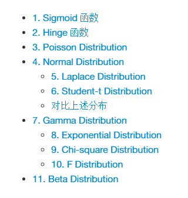

 Ditributions 

[TOC]

# 0. Introdution
[distribution.md](distributions.md)列出了常见的分布和函数的公式介绍以及绘图说明。目录如下：

其中Sigmoid函数和Hinge函数是在ML中常见的损失函数，可以通过调整相关的中心位置以及曲线坡度控制函数的形态

Poisson分布是离散的概率分布，描述单位时间内随机事件发生的次数的概率分布。

Normal分布、Laplace分布以及Student-T分布都有着类似的函数形态，因此将三者放在一栏中，其中laplace分布可以看作是一种对称的指数分布，Student-T的分布形态和正态分布类似，通过控制自由度的大小，可以控制其与标准正态分布拟合程度，自由度越高,越接近正态分布

Gamma分布描述的是n个事件共同发生的时间的问题，而指数分布(Exponential Distribution)描述的是随机事件发生一次的时间的分布。从这可以看出，指数分布和泊松分布有着很大的关联：$Pr(T_i > t+s|T_{i-1}=s)=Pr(N(t+s)-N(s)=0)=e^{-\lambda t}$泊松分布两次事件的时间间隔就是指数分布。

卡方分布描述的是n个独立同分布(iid)的标准正态分布的随机变量的平方和的分布,n就是卡方分布中的自由度,n越高，方差越大（分布越分散），F分布是两个独立的卡方分布的比值

Beta分布是定义在(0,1)区间上的分布，是一种概率分布的分布。

# 1. Dependencies
enviroment:

> python

python package:

>numpy  scipy   matplotlib
>enhanced-markdown parser

# 2. Others
推荐使用atom或者vs code浏览编辑，因为加入了一些latex公式，所以请使用拓展的markdown解释器（KaTex、TOC支持），推荐[Markdown-preview-enhance插件](https://github.com/shd101wyy/markdown-preview-enhanced),atom和vs code都可以下载使用
